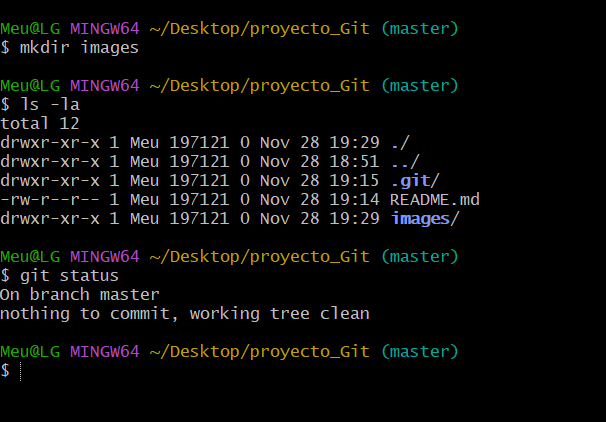
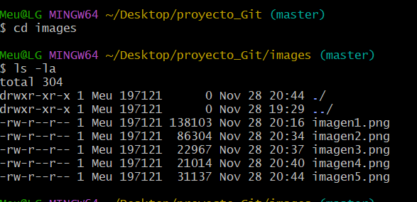
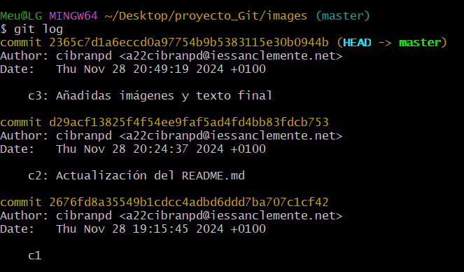

# Tarea GIT

## 1. Instalar Git Bash
El primer paso es abrir el símbolo de sistema para instalar Git Bash.  
Usamos el siguiente comando:  

```bash
winget install git.git
```


---

## 2. Configurar usuario en Git
Git necesita saber quién eres para registrar los cambios realizados en un proyecto.  
Configuramos nuestro nombre y correo electrónico con los comandos:  

```bash
git config --global user.name "cibranpd"
git config --global user.email "a22cibranpd@iessanclemente.net"
```


---

## 3. Crear el directorio del proyecto
Abrimos Git Bash y nos ubicamos en el directorio donde queremos crear el proyecto.  
Ejecutamos los siguientes comandos:  

- **mkdir**: crea un nuevo directorio.  
- **cd**: nos mueve dentro del directorio creado.


## 4. Inicializar un repositorio Git
Inicializamos un repositorio Git en el directorio con el comando:  

```bash
git init
```


---

## 5. Abrir VS Code y crear el archivo `README.md`
Abrimos el proyecto en **VS Code** desde Git Bash con el comando:  

```bash
code .
```

En VS Code, seleccionamos **Nuevo archivo** y lo nombramos `README.md`.

---

## 6. Añadir el archivo al repositorio y hacer el primer commit
Agregamos el archivo `README.md` al repositorio Git:  

```bash
git add .
git commit -m "c1"
```

Verificamos el estado del repositorio con:  

```bash
git status
```


---

## 7. Crear una carpeta para las imágenes
Creamos una carpeta llamada `images` para almacenar las capturas de pantalla:  

```bash
mkdir images
```

Revisamos los archivos del proyecto con:  

```bash
ls -la
```

Y verificamos su estado con:  

```bash
git status
```



---

## 8. Editar el archivo `README.md` en VS Code
Abrimos el archivo `README.md` en VS Code y añadimos el texto correspondiente para documentar el proceso.

---

## 9. Realizar un segundo commit
Volvemos a Git Bash, añadimos los cambios al área de preparación y realizamos un segundo commit:  

```bash
git add .
git commit -m "c2: Actualización del README.md"
```

---

## 10. Añadir imágenes y actualizar el `README.md`
Copiamos las imágenes en la carpeta `images` y actualizamos el archivo `README.md` para incluirlas.



---

## 11. Realizar el tercer commit
Realizamos el tercer commit para guardar los cambios finales. Se pueden ver las diferentes instantáneas con git log  

```bash
git add .
git commit -m "c3: Añadidas imágenes y texto final"
git log
```


## 12. Crear el repositorio remoto
1.	Vamos a GitHub y creamos un nuevo repositorio.
2.	Copiamos la URL del repositorio.
3. En Git Bash añadimos el repositorio remoto, usamos el comando `git remote add nombre_repositorio
url_repositorio`
4. Para subir los cambios a un repositorio remoto, usamos el comando `git push origin
nombre_rama`
